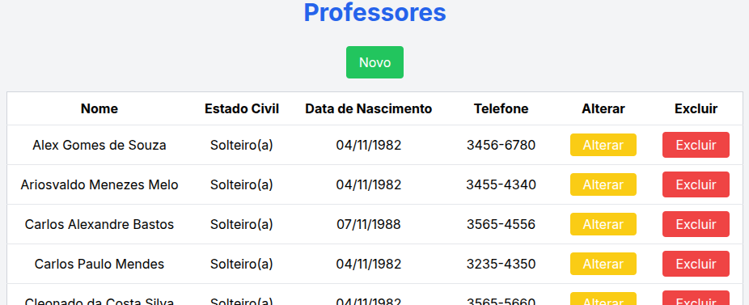

# Exercício Completo: Implementando um CRUD para a Tabela "Professor"

## Objetivo
Implementar um CRUD completo (Create, Read, Update, Delete) para a tabela `professor`, que irá interagir com uma API REST. A interface frontend será construída utilizando **Next.js**. O CRUD incluirá funcionalidades para listar, adicionar, editar e excluir professores. A página principal conterá um **grid de professores**, além de telas dedicadas para **inserção** e **edição**.

---

## Parte 1: Estrutura da Tabela `professor` no Banco de Dados

A tabela `professor` deverá ser criada com a seguinte estrutura no banco de dados, com os campos:
    id_professor     SERIAL                 NOT NULL,
    id_titulo        INTEGER                NOT NULL,  
    tx_nome          CHARACTER VARYING(50)  NOT NULL,
    tx_sexo          CHAR(1)                NOT NULL,
    tx_estado_civil  CHAR(1)                NOT NULL,
    dt_nascimento    DATE                   NOT NULL,
    tx_telefone      CHARACTER VARYING(13)  NOT NULL,  


## Parte 2: Backend - API REST

### Endpoints da API para o CRUD da Tabela `professor`
Você deverá implementar os seguintes endpoints no backend para manipular a tabela `professor`:

1. **Inserir um novo professor (POST)**:
    ```bash
    curl -X POST https://seu-endereco-deploy/.netlify/functions/api/professor \
    -H "Content-Type: application/json" \
    -d '{
      "id_titulo": 1,
      "tx_nome": "Nome do Professor",
      "tx_sexo": "m",
      "tx_estado_civil": "s",
      "dt_nascimento": "1980-01-01",
      "tx_telefone": "79999999999"
    }'
    ```

2. **Buscar todos os professores (GET)**:
    ```bash
    curl -X GET https://seu-endereco-deploy/.netlify/functions/api/professor
    ```

3. **Buscar professor por ID (GET)**:
    ```bash
    curl -X GET https://seu-endereco-deploy/.netlify/functions/api/professor/ID_DO_PROFESSOR
    ```

4. **Atualizar um professor existente (PUT)**:
    ```bash
    curl -X PUT https://seu-endereco-deploy/.netlify/functions/api/professor/ID_DO_PROFESSOR \
    -H "Content-Type: application/json" \
    -d '{
      "id_titulo": 1,
      "tx_nome": "Nome Atualizado",
      "tx_sexo": "f",
      "tx_estado_civil": "c",
      "dt_nascimento": "1985-05-05",
      "tx_telefone": "79999999999"
    }'
    ```

5. **Deletar um professor (DELETE)**:
    ```bash
    curl -X DELETE https://seu-endereco-deploy/.netlify/functions/api/professor/ID_DO_PROFESSOR
    ```

---

## Parte 3: Frontend em Next.js

## Objetivo
Este exercício consiste em implementar um CRUD completo (Create, Read, Update, Delete) para a tabela `professor`, utilizando **Next.js** no frontend e uma API REST no backend. A interface deve ser simples, funcional e atender às seguintes especificações:

---

### 3.1. Página Principal - Grid de Professores

A **página principal** será a única página disponível no sistema, contendo um **grid** com a lista de todos os professores. Cada registro no grid deve exibir os seguintes campos:
- **Nome**
- **Estado Civil** (traduzido como "Solteiro(a)", "Casado(a)" ou "Divorciado(a)")
- **Data de Nascimento** (no formato dd/mm/yyyy)
- **Telefone**

#### Funcionalidades:
- Os dados devem ser ordenados alfabeticamente pelo **Nome**.
- Haverá dois botões de ação em cada linha:
  - Um botão **Alterar**, que redireciona o usuário para a tela de edição do professor selecionado.
  - Um botão **Excluir**, que permitirá a remoção do professor da lista e do banco de dados.
- **Botão Novo**: No topo da página, haverá um botão verde com o texto **"Novo"**, que redireciona o usuário para a página de inserção de um novo professor.
- **Carregamento**: Enquanto os dados estão sendo carregados da API, deve aparecer a mensagem **"CARREGANDO..."** e um spinner de carregamento, centralizados logo abaixo do título "Professores".
- O grid de professores só será exibido após o término do carregamento.

---

### 3.2. Tela de Inserção de Novo Professor

A tela de inserção permitirá adicionar um novo professor ao sistema. Deve conter os seguintes campos de entrada:
- **Nome**
- **Sexo** (com as opções "Masculino" e "Feminino")
- **Estado Civil** (com as opções "Solteiro(a)", "Casado(a)" e "Divorciado(a)")
- **Data de Nascimento**
- **Telefone**

#### Funcionalidades:
- O campo **id_titulo** será fixo e enviado como `1` ao backend, mas **não aparecerá no formulário**.
- **Botão Adicionar**: Deve haver um botão verde com o texto **"Adicionar Professor"**, que submeterá o formulário.
- **Botão Retornar**: Logo abaixo do botão de inserção, haverá um botão azul com o texto **"Retornar"**, que redirecionará o usuário para a página principal com o grid.
- Após a inserção bem-sucedida, o sistema deve redirecionar automaticamente para a página principal (o grid de professores).
- O formulário será exibido dentro de um **formulário branco com bordas arredondadas**, e o fundo por trás do formulário será cinza claro.

---

### 3.3. Tela de Edição de Professor

A tela de edição permitirá modificar os dados de um professor existente. Ela será semelhante à tela de inserção, mas com os dados preenchidos previamente. Deve conter os seguintes campos:
- **Nome**
- **Sexo** (com as opções "Masculino" e "Feminino")
- **Estado Civil** (com as opções "Solteiro(a)", "Casado(a)" e "Divorciado(a)")
- **Data de Nascimento**
- **Telefone**

#### Funcionalidades:
- **Botão Atualizar**: Deve haver um botão verde com o texto **"Atualizar Professor"**, que submeterá as alterações para a API e, em caso de sucesso, redirecionará para a página principal.
- **Botão Retornar**: Logo abaixo do botão de atualização, haverá um botão azul com o texto **"Retornar"**, que redirecionará o usuário para a página principal com o grid.
- **Botão Deletar**: Também haverá um botão vermelho com o texto **"Deletar Professor"**, que excluirá o professor do sistema e redirecionará para a página principal.
- O formulário de edição será exibido dentro de um **formulário branco com bordas arredondadas**, e o fundo por trás do formulário será cinza claro.

### 3.4. Resultado Final



